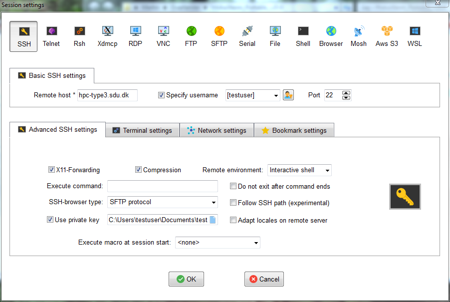

.. |br| raw:: html

    

.. |nbsp| unicode:: U+00A0

.. |randomart| raw:: html

   +---[RSA 3072]----+
    
   |&nbsp;&nbsp;&nbsp;&nbsp;&nbsp;&nbsp;&nbsp;&nbsp;&nbsp;.=o...=O|
    
   |&nbsp;&nbsp;&nbsp;&nbsp;&nbsp;&nbsp;&nbsp;&nbsp;&nbsp;+o+&nbsp; o +|
    
   |&nbsp;&nbsp;&nbsp;&nbsp;&nbsp;&nbsp;&nbsp;&nbsp;..+ ..&nbsp;&nbsp; |
    
   |&nbsp;&nbsp;&nbsp;&nbsp;+ .&nbsp; . .&nbsp; o&nbsp; |
    
   |&nbsp;&nbsp;&nbsp;= + +S&nbsp;&nbsp;&nbsp; + . |
    
   |&nbsp;&nbsp;&nbsp;&nbsp;* Eo.&nbsp;&nbsp;&nbsp;&nbsp; +.o|
    
   |&nbsp;&nbsp;&nbsp;&nbsp;&nbsp;* ..&nbsp; . + o+|
    
   |&nbsp;&nbsp;&nbsp;&nbsp;&nbsp;&nbsp;+ o o * +..|
    
   |&nbsp;&nbsp;&nbsp;&nbsp;&nbsp;&nbsp;&nbsp;&nbsp;&nbsp;=o+.+&nbsp; .|
    
   +----[SHA256]-----+

SSH Login
==================
Secure Shell (SSH) is a way to log in to remote computers securely as all data is encrypted in both directions between the local computer and the remote computer.

Using SSH keys is an even more secure way to use SSH to access a remote computer as there is no password exchange between the local and remote computer. An SSH key pair is generated on the local computer. The key pair consists of a private key which stays on your local computer and a public key which must be uploaded to the remote computer.

Using SSH keys is the only way to get remote access to the Type 3 system. The steps below describe how to generate your own SSH key for access to the cluster.

Linux/Mac
------------------
Linux and macOS users have an OpenSSH client installed on their system by default and do not need to do anything specific.

First, start by checking for existing keys on your computer. Open a terminal and type:

.. code-block:: console

   user@laptop:~$ ls -la ~/.ssh/

|br|
You should see a list of files in your ``.ssh`` directory if they exist.
Check to see whether you already have a public SSH key. By default, filenames of public keys are one of the following:

.. code-block:: text

   id_ecdsa.pub
   id_ed25519.pub
   id_rsa.pub

|br|
If you have a file ending with ``.pub`` and also have the file without ``.pub``, such as ``id_rsa.pub`` and ``id_rsa``, and you can remember the passphrase for your SSH key pair, then you can skip the next step.

Generate a new SSH key
^^^^^^^^^^^^^^^^^^^^^^^^^^^^^^^
Run the following command to generate a new SSH key. Replace *My PC* with a descriptive text of the computer you are generating the key on. You should use a strong passphrase to protect the key.

.. code-block:: console

   user@laptop:~$ ssh-keygen -C "My PC"

.. tip::

 |br|
 Generating public/private rsa key pair.
 |br|
 Enter file in which to save the key (/home/user/.ssh/id_rsa):
 |br|
 Enter passphrase (empty for no passphrase):
 |br|
 Enter same passphrase again:
 |br|
 Your identification has been saved in /home/user/.ssh/id_rsa
 |br|
 Your public key has been saved in /home/user/.ssh/id_rsa.pub
 |br|
 The key fingerprint is:
 |br|
 SHA256:TtFJwRZ+cB3d1FXoS863F6d6eIhyfpYqSEhmy5PP1LA My PC
 |br|
 The key's randomart image is:
 |br|
 |randomart|

When requesting an account, you need to provide the public part of the key to gain access to the system.

Connecting to the system
^^^^^^^^^^^^^^^^^^^^^^^^^^^^^^^
After your account has been created on the system, you are ready to log in using your SSH key. Open a terminal and use the ``ssh`` command as shown below, where you should replace ``testuser`` with your assigned username.

.. code-block:: console

   user@laptop:~$ ssh testuser@hpc-type3.sdu.dk

|br|
To copy files to and from the system you can use direct ``scp`` or ``sftp`` to the frontend node. These operations will also require the use of your SSH key.

SSH configuration
^^^^^^^^^^^^^^^^^^^^^^^^^^^^^^^
You can use the file ``~/.ssh/config`` to setup parameters for SSH that you otherwise need to enter at each login. This is done on the client (your laptop). Basically you create a section for each remote computer.

.. code-block:: text

   #
   # Contents of ~/.ssh/config on your laptop
   #
   Host type3
       Hostname hpc-type3.sdu.dk
       User testuser

|br|
With the above file in place, you can now simply use the following command to access the system.

.. code-block:: console

   user@laptop:~$ ssh type3

Windows
------------------
For Windows users we recommend using either `MobaXterm <https://mobaxterm.mobatek.net>`_ or `PuTTY <https://www.putty.org>`_ to access the system.

* MobaXterm includes a lot of extra features compared to PuTTY, including easy GUI file transfers. The free version of MobaXterm is enough for most users.
* PuTTY is probably the most popular Windows SSH program. PuTTY consists of several smaller binaries, including in particular putty.exe (used to actually do ssh), and PuTTYgen (used to generate SSH keys). We suggest to use the PuTTY Windows MSI installer, which includes all programs.

Before continuing to the next step, you should download and install either MobaXterm or PuTTY.

Generate a new SSH key
^^^^^^^^^^^^^^^^^^^^^^^^^^^^^^^
To generate a new SSH key open the relevant program.

* MobaXterm: Launch MobaXterm, and select *Tools » MobaKeyGen (SSH key generator)* in the menu.
* PuTTY: Launch the PuTTYgen key generation program.

In both cases you get a window similar to the following.

To create a new key you should leave the default parameters at RSA and a key length of 2048 bits. Click *Generate* to generate a new key. After they key has been generated the screen is updated with information on the new key.

Add a key comment (such as *My PC*) and write a strong passphrase to protect the key. Finally, save the two parts of the key. For both parts of the key pair we suggest saving them in a folder you can easily find again, such as your *Documents* folder.

* *Public key*: This is the public part of the key which you must attach when applying for an account on the system. The easiest way to get the public key in a suitable format is to copy the content of the frame titled *Public key for pasting into OpenSSH authorized_keys file*. Highlight and copy everything in the frame to the clipboard. Next, open notepad and paste the contents. Everything must be in one (very long) line. Save the contents in a file with the extension .txt for easy access later, such as *id_rsa_pub.txt*. Be aware that clicking *Save public key* will not save the public key in a format suitable for accesing our system.
* *Private key*: This is the private part of the key which stays on your own computer. Click *Save private key* to save the private key in "PuTTY format". For easy access later, save this in a file with the extension .ppk, such as *id_rsa.ppk*.

Note that you can use the same key pair to access multiple remote system if needed.

Connecting to the system
^^^^^^^^^^^^^^^^^^^^^^^^^^^^^^^

**MobaXterm**

Start the main MobaXterm program. A window similar to this appears. Note that you can skip the first many steps after you have completed this the first time.

In the top left corner, click *Session* and a new window appears. In the new window select SSH session and fill out a few details.

* Remote Host: hpc-type3.sdu.dk
* Username: Your assigned username
* Use private key: Under "Advanced SSH settings" select the private key you generated earlier.

Once you have filled in the information, you should be able to connect to the system.

Next time, you can open a connection to the system by simply using the link to *hpc-type3.sdu.dk* on the first page of MobaXterm.

**PuTTY**

Start the main PuTTY program. A window similar to this appears. Note that you can skip the first many steps after you have completed this the first time.

.. image:: ../extra/figures/putty0.png
   :width: 400px

To configure the connection, complete the following steps.

* Select *Connection » SSH » Auth* in the menu on the left, and select *Browse...* to locate the private SSH key you generated earlier.
* Next, go to the submenu *Connection » Data*, and set the username you have been assigned on our system in Auto-login username.
* Return to the main *Session* submenu, and write the hostname *hpc-type3.sdu.dk*.
* Save these settings as a *Saved Session* to skip the previous steps at future logins, by writing e.g. Type3 in the *Saved Sessions* box, and click Save.

In the future, you can simply double click saved session to load all the settings. To log in simply click *Open*. You will be asked for the passphrase for your SSH key before you are allowed to log in.

Additional SSH keys
----------------------

After your account on the system has been created, you will be able to access the cluster via SSH from your local laptop.

In order to log in from a different computer, you need to copy the public SSH key stored on that computer to your user account on the cluster.

First, log in to the the cluster:

.. code-block:: console

   user@laptop:~$ ssh testuser@hpc-type3.sdu.dk

The file ``~/.ssh/authorized_keys`` should already exist in your home folder. Any key added to this file (one key per line) will be accepted when accessing the system. Use your favorite editor, such as ``vim``, ``nano``, or ``mcedit``, to modify the file.

After editing the file, the content should look smilar to this:

.. code-block:: console

   [testuser@frontend ~]$ cat ~/.ssh/authorized_keys

.. tip::

   ssh-ed25519 AAAA..xyz MyLaptop
   |br|
   ssh-rsa AAAA..xyz MyDesktop

In this example, the keys have been redacted, and in reality they will be a lot longer.
