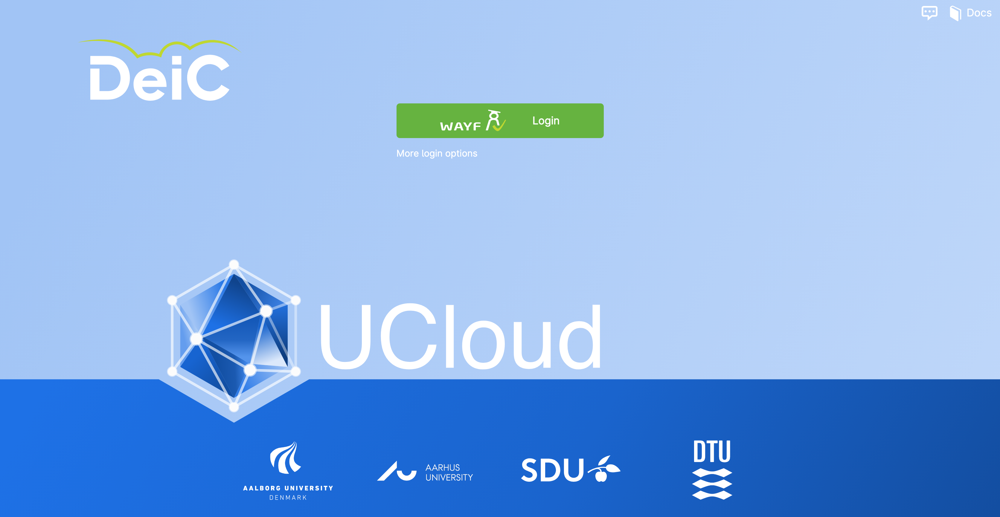
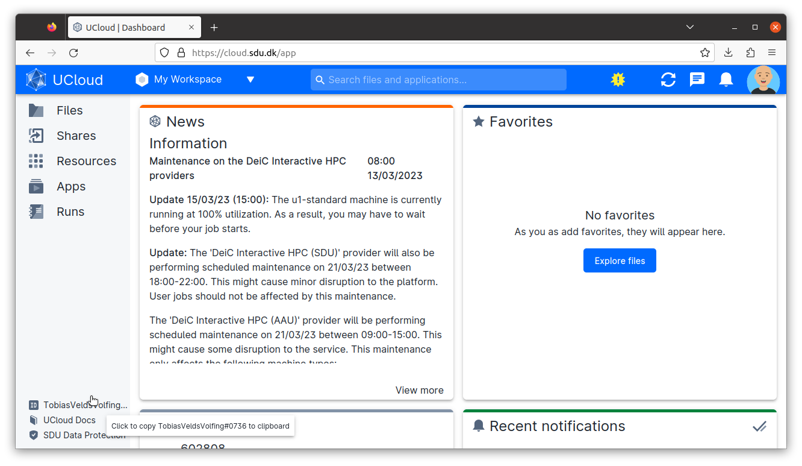
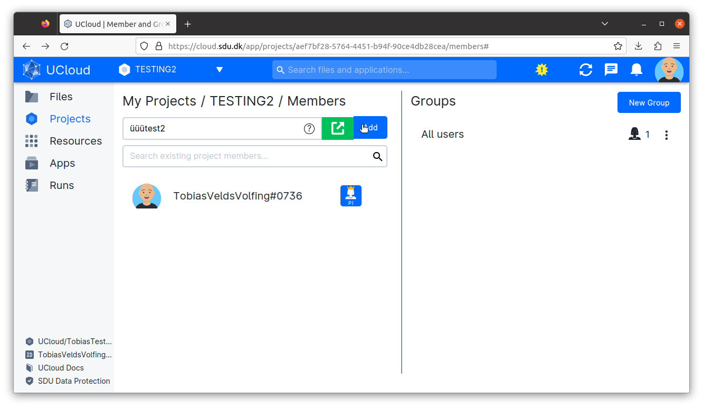
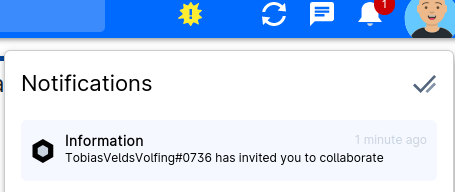
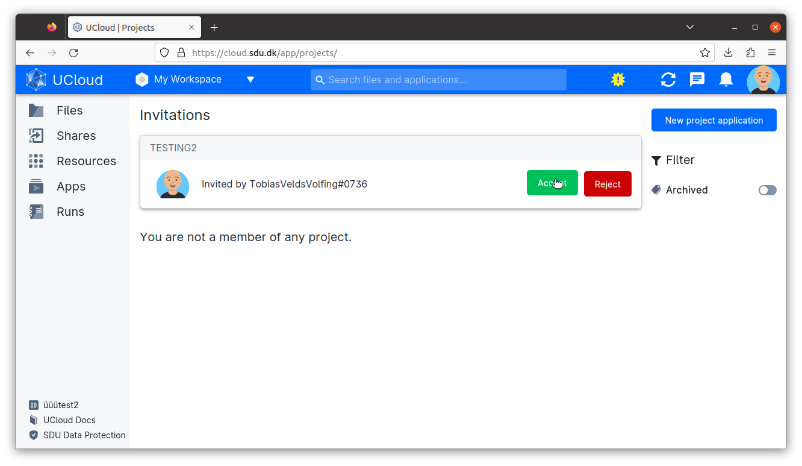
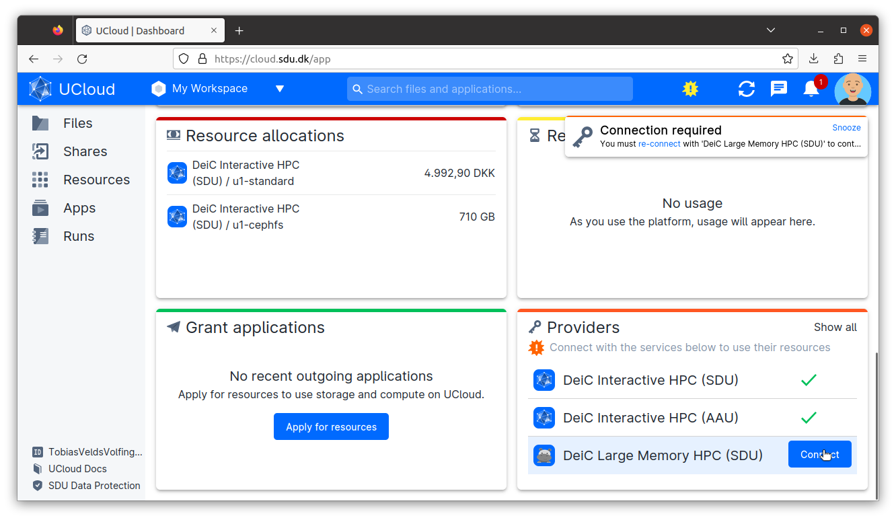
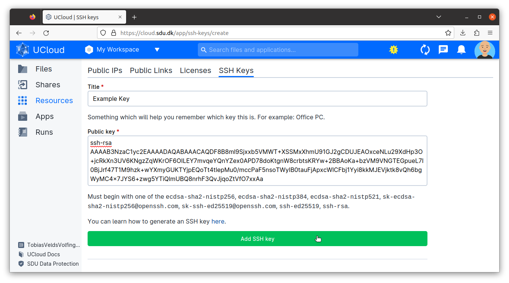

UCloud Integration
==================
The Hippo HPC cluster is connected to the web-based UCloud platform, which allows you to manage most aspects of the system directly from your browser.

- Submit and monitor Slurm jobs.
- Upload, download, and manage your files.
- Project management (adding and removing users, applying for additional resources, track resource usage).
- Upload SSH keys to the system.

The following sections will give a quick introduction to the UCloud platform.

Login
-----

UCloud can be accessed via the URL: `cloud.sdu.dk`_.

To access the platform you need to click on the *WAYF* (*Where Are You From*) button. This allows any user affiliated with a Danish educational institution to access the platform without a separate account. All they need is the username and password from their own institution.

The SDU eScience `terms of service`_ must be approved upon first access. Afterwards, the user is redirected to the `UCloud user interface`_.

Once logged in, the user has the option to set up `two factor authentication`_ by clicking on the avatar icon in the upper right corner of the home screen.

UCloud ID
_______________

A unique UCloud ID is generated for you the first time you login using WAYF. This ID can be seen in the bottom left corner of the UCloud interface.

Projects
--------

Inviting users to projects
__________________________

- Navigate to the top left corner of the UCloud interface and click on the chevron next to *My Workspace*. If you have changed your workspace, this will display the name of your currently selected workspace instead.
- From the dropdown menu, select *Manage projects*. This will open the `My Projects`_ page.
- Under *My Projects* click on the title of your project. This will open the project dashboard.
- Click on *Members*.
- Type in the ID and click *Add*. The user has now been invited, but they still need to accept the invitation before they are part of the project.

Accepting an invitation
_______________________

When you are invited to a project you will receive a notification. Navigate to the top right corner of the UCloud interface and click the bell button to access your notifications.

Clicking on the notification will take you to a new page where you can accept the invitation.

Connecting to the provider
--------------------------

Once you are a member of a project, you need to connect to the provider before you can begin to submit jobs.
From the frontpage of UCloud, locate the *Providers* frame and click *Connect* next to the *DeiC Large Memory HPC (SDU)* provider.

SSH
---

Uploading your SSH key
______________________

- Navigate to the panel on left side of the UCloud interface and click on *Resources*.
- Click on the tab *SSH Keys*. This will take you to the `SSH Keys`_ page.
- Click on *Create SSH key*. This will take you to the `page`_ displayed below.

Give your key a title, paste the key into the `Public key` field and click `Add SSH key`.

SSH username
____________

Your SSH username will be different from your UCloud ID. For the time being, the only way to see your SSH username is to start a job.

Users with existing SSH access can see the usernames of all users in their projects using the following command:

.. code-block:: console

	[sshuser@hippo-fe ~]$ myquota -l

.. _My Projects: https://cloud.sdu.dk/app/projects
.. _cloud.sdu.dk: https://cloud.sdu.dk/
.. _terms of service: https://legal.cloud.sdu.dk/
.. _UCloud user interface: https://docs.cloud.sdu.dk/guide/navigation-intro.html
.. _two factor authentication: https://docs.cloud.sdu.dk/guide/navigation-topbar.html#two-factor-authentication
.. _SSH Keys: https://cloud.sdu.dk/app/ssh-keys
.. _page: https://cloud.sdu.dk/app/ssh-keys/create
