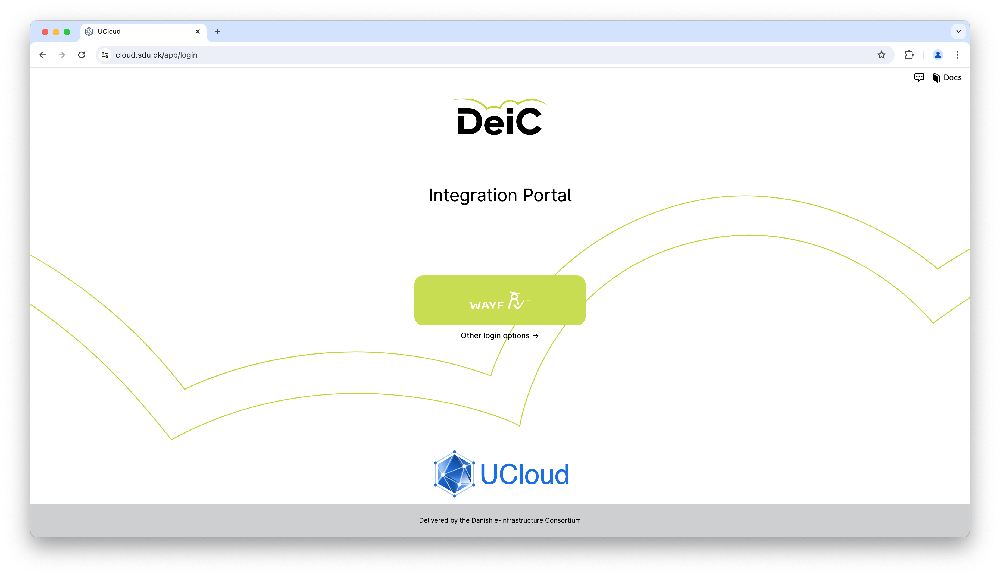
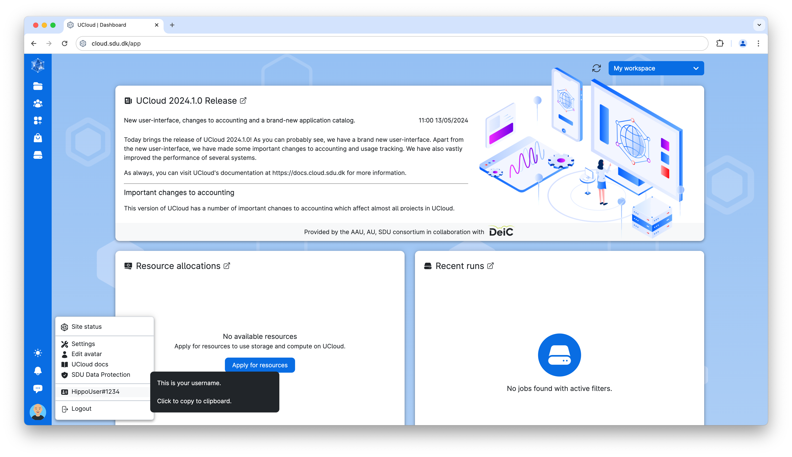
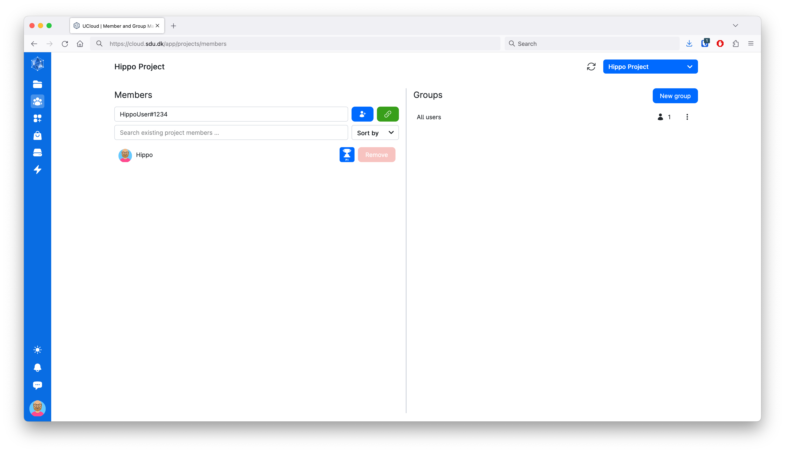
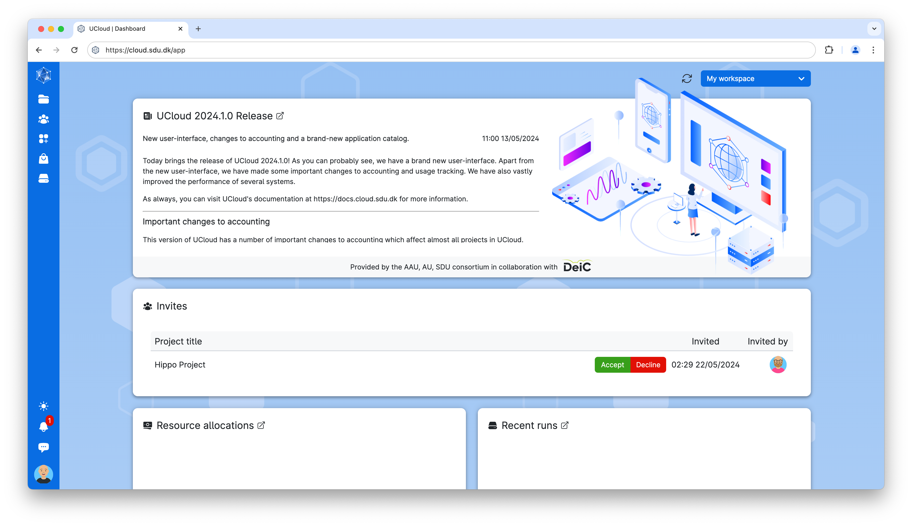
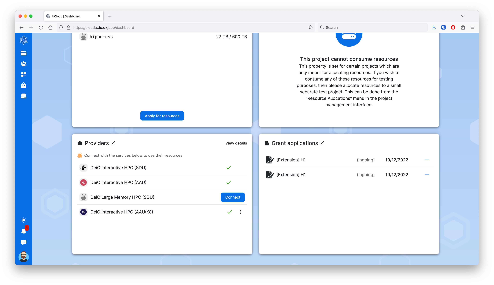
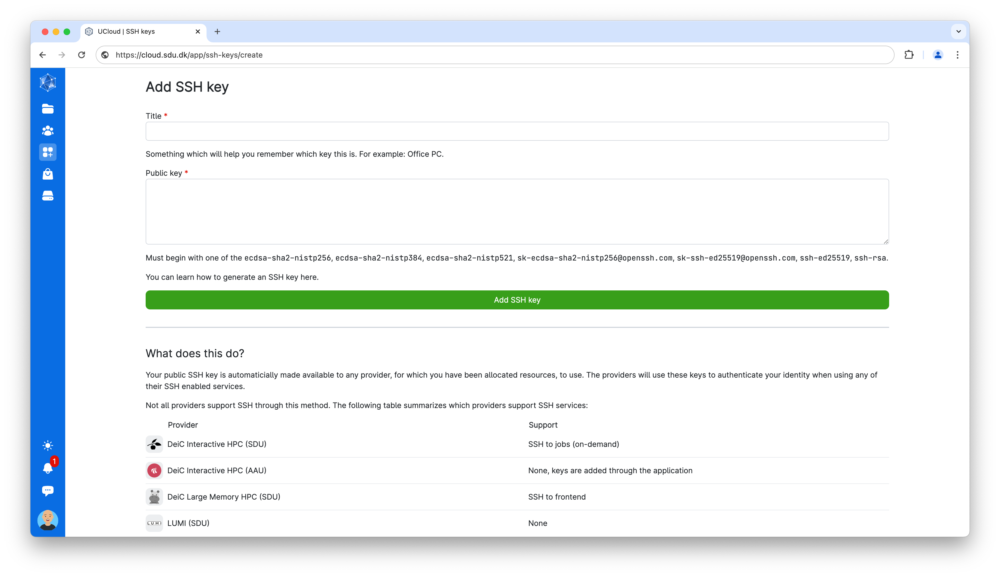

UCloud Integration
==================
The Hippo HPC cluster is connected to the web-based UCloud platform, which allows you to manage most aspects of the system directly from your browser.

- Submit and monitor Slurm jobs.
- Upload, download, and manage your files.
- Project management (adding and removing users, applying for additional resources, track resource usage).
- Upload SSH keys to the system.

The following sections will give a quick introduction to the UCloud platform.

Login
-----

UCloud can be accessed via `cloud.sdu.dk`_.

To access the platform you need to click on the *WAYF* (*Where Are You From*) button. This allows any user affiliated with a Danish educational institution to access the platform without a separate account. All they need is the username and password from their own institution.

The SDU eScience `terms of service`_ must be approved upon first access. Afterwards, the user is redirected to the `UCloud user interface`_.

Once logged in, the user has the option to set up `two factor authentication`_ by clicking on the avatar icon in the lower left corner of the home screen and then under settings.

UCloud ID
_______________

A unique UCloud ID (username) is generated the first time you login using WAYF. This ID can be found by clicking the avatar in the lower left corner of the UCloud interface.

Projects
--------

Projects are used to collaborate and share resources and files.

Inviting users to projects
__________________________

In the menu on the left, the second icon from the top is the project tab. When hovering the mouse over this icon, the secondary sidebar will expand and under "Members" you can manage members of your project.

To add a new member, type their UCloud ID in the input field (as shown on the screenshot below) and click the add button. The user has now been invited, but they still need to accept the invitation before they are part of the project.

Accepting an invitation
_______________________

When you are invited to a project you will receive a notification and on the dashboard you can accept or reject project invitations.

Connecting to the provider
--------------------------

Once you are a member of a project with resources on Hippo, you need to connect to the provider before you can access the system.
On the UCloud dashboard locate the *Providers* section and click *Connect* next to the *DeiC Large Memory HPC (SDU)* provider.

SSH
---

Uploading your SSH key
______________________

In the menu on the left, the third icon on the left is the resources section. Hover over this icon with the mouse and select "SSH keys".

- Click on *Add SSH key* button, which  will take you to the `page`_ displayed below.
- Give your key a title, paste the key into the `Public key` field and click `Add SSH key`.

SSH username
____________

Your SSH username will be different from your UCloud ID. For the time being, the only way to see your SSH username is to start a job.

Users with existing SSH access can see the usernames of all users in their projects using the following command:

.. code-block:: console

	[user@frontend ~]$ myquota -l

.. _cloud.sdu.dk: https://cloud.sdu.dk
.. _terms of service: https://legal.cloud.sdu.dk
.. _UCloud user interface: https://docs.cloud.sdu.dk/guide/navigation-intro.html
.. _two factor authentication: https://cloud.sdu.dk/app/users/settings
.. _SSH Keys: https://cloud.sdu.dk/app/ssh-keys
.. _page: https://cloud.sdu.dk/app/ssh-keys/create
